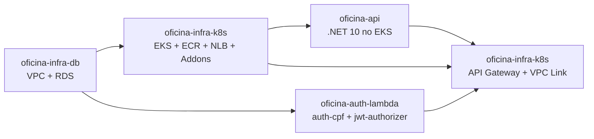
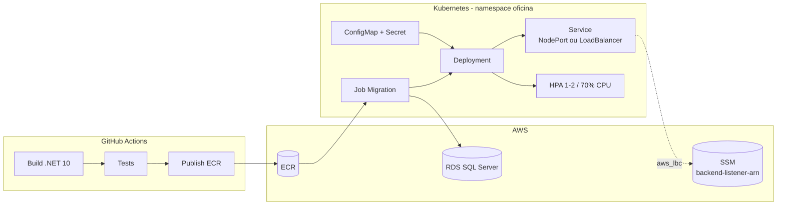

# oficina-api

API REST principal da solução Oficina — gestão de clientes, veículos, peças, estoque, serviços, orçamentos e ordens de serviço.

[]()
[]()
[]()
[]()

## Sumário

- 🎯 [Visão geral](#visão-geral)
- 🧩 [Solução integrada](#solução-integrada)
- 🏗️ [Arquitetura](#arquitetura)
- 🔄 [Consumido e gerado](#consumido-e-gerado)
- ⚙️ [Configuração](#configuração)
- ▶️ [Execução](#execução)
- ✅ [Validação](#validação)
  - [Swagger e Postman](#swagger-e-postman)
- 💻 [Execução local](#execução-local)
- 📊 [Observabilidade](#observabilidade)
- ➡️ [Próxima etapa](#próxima-etapa)

---

## <a id="visão-geral"></a> 🎯 Visão geral

Aplicação .NET 10 que constrói a imagem Docker, publica no ECR, executa migrations no RDS e implanta no EKS.

- Imagem ECR taggeada com `commit-sha` e `latest` (idempotente).
- Job Kubernetes aplica migrations no RDS antes do Deployment.
- Service `NodePort` (modo `terraform_nlb`) ou `LoadBalancer` interno (modo `aws_lbc`).
- HPA por CPU, usando o Metrics Server instalado pelo passo 2 do [oficina-infra-k8s](https://github.com/fabianorodrigues/oficina-infra-k8s).
- Em `aws_lbc`, grava o Listener ARN do NLB no SSM após o Service subir.

**Tecnologias:** .NET 10, ASP.NET Core, Entity Framework Core, SQL Server, Docker, Kubernetes (EKS), AWS ECR/SSM, OpenTelemetry, Serilog, Swagger/OpenAPI, Postman, GitHub Actions.

---

## <a id="solução-integrada"></a> 🧩 Solução integrada

A solução Oficina é composta por 4 repositórios que formam um sistema de gestão de oficina mecânica na AWS.



| Passo | Repositório | Quando |
|---|---|---|
| 1 | [oficina-infra-db](https://github.com/fabianorodrigues/oficina-infra-db) | sempre |
| 2 | [oficina-infra-k8s](https://github.com/fabianorodrigues/oficina-infra-k8s) — core + addons | sempre |
| **3** | **[oficina-api](https://github.com/fabianorodrigues/oficina-api) — 1º deploy** | **sempre — este repositório** |
| 4 | [oficina-auth-lambda](https://github.com/fabianorodrigues/oficina-auth-lambda) | sempre |
| 5 | [oficina-infra-k8s](https://github.com/fabianorodrigues/oficina-infra-k8s) — api-gateway | sempre |
| **6** | **[oficina-api](https://github.com/fabianorodrigues/oficina-api) — redeploy** | **opcional — este repositório, se `public-base-url` precisa entrar nos e-mails** |
| 7 | [oficina-infra-k8s](https://github.com/fabianorodrigues/oficina-infra-k8s) — observability | opcional, após o passo 5 |

> [!NOTE]
> No passo 2, o Metrics Server é sempre instalado (HPA da API depende dele); o AWS Load Balancer Controller só é instalado quando `LOAD_BALANCER_PROVISIONING_MODE=aws_lbc`.

---

## <a id="arquitetura"></a> 🏗️ Arquitetura



---

## <a id="consumido-e-gerado"></a> 🔄 Consumido e gerado

**Consome:**

| Origem | Valores |
| --- | --- |
| `oficina-infra-db` | `db_address`, `db_port`, `db_name` (compõem `DB_CONNECTION_STRING`) |
| `oficina-infra-k8s` (core) | `ECR_REPOSITORY_URL`, `EKS_CLUSTER_NAME` |
| `oficina-auth-lambda` | JWT (`JWT_SECRET`, `JWT_ISSUER`, `JWT_AUDIENCE`, `JWT_EXPIRATION_MINUTES`) — idênticos |
| `oficina-infra-k8s` (api-gateway) | SSM `public-base-url` (links de e-mail) |

**Gera:**

| Saída | Consumido por |
| --- | --- |
| Imagem ECR (`<commit-sha>` + `latest`) | EKS (passo 3/6) |
| Recursos K8s no namespace `oficina` (Deployment, Service, HPA, ConfigMap, Secret) | execução em runtime |
| SSM `/<projeto>/<ambiente>/api/backend-listener-arn` (apenas em `aws_lbc`) | api-gateway (passo 5) |

---

## <a id="configuração"></a> ⚙️ Configuração

Configure em **GitHub > Settings > Secrets and variables > Actions**.

> [!IMPORTANT]
> **JWT idêntico** ao [oficina-auth-lambda](https://github.com/fabianorodrigues/oficina-auth-lambda): se `JWT_SECRET`, `JWT_ISSUER`, `JWT_AUDIENCE` ou `JWT_EXPIRATION_MINUTES` divergir, tokens emitidos pela Lambda não são aceitos pela API.

> [!WARNING]
> **SMTP tudo ou nada**: se uma variável SMTP estiver preenchida, todas devem estar (`EMAIL_SMTP_HOST`, `EMAIL_SMTP_PORT`, `EMAIL_ENABLE_SSL`, `EMAIL_FROM`, `EMAIL_SMTP_USERNAME`, `EMAIL_SMTP_PASSWORD`). Caso contrário, o workflow falha na validação.

### AWS, ECR e EKS

| Nome | Tipo | Obrigatório | Descrição |
| --- | --- | --- | --- |
| `AWS_ACCESS_KEY_ID`, `AWS_SECRET_ACCESS_KEY`, `AWS_REGION` | Secret | sim | Credenciais AWS |
| `AWS_SESSION_TOKEN` | Secret | não | Credenciais temporárias (STS) |
| `ECR_REPOSITORY_URL` | Secret | sim | URL do ECR (do `oficina-infra-k8s` core) |
| `EKS_CLUSTER_NAME` | Secret | sim | Nome do cluster EKS |
| `DB_CONNECTION_STRING` | Secret | sim | Connection string SQL Server |

### JWT

| Nome | Tipo | Obrigatório | Descrição |
| --- | --- | --- | --- |
| `JWT_SECRET` | Secret | sim | Chave de assinatura (mínimo 32 caracteres) |
| `JWT_ISSUER` | Secret | sim | Issuer JWT |
| `JWT_AUDIENCE` | Secret | sim | Audience JWT |
| `JWT_EXPIRATION_MINUTES` | Secret | sim | Expiração em minutos |

### SMTP e e-mails

| Nome | Tipo | Obrigatório | Descrição |
| --- | --- | --- | --- |
| `EMAIL_SMTP_HOST`, `EMAIL_SMTP_PORT`, `EMAIL_ENABLE_SSL`, `EMAIL_FROM` | Variable | condicional | Configuração SMTP |
| `EMAIL_SMTP_USERNAME`, `EMAIL_SMTP_PASSWORD` | Secret | condicional | Credenciais SMTP |
| `EMAIL_BASE_URL_APROVA_RECUSA_ORCAMENTO` | Variable | não | URL base para links; se vazio, busca o SSM `public-base-url` |

### Admin inicial (opcional)

Usado apenas quando o input do workflow `enable_initial_admin=true`.

| Nome | Tipo | Descrição |
| --- | --- | --- |
| `ADMIN_INICIAL_NOME`, `ADMIN_INICIAL_CPF`, `ADMIN_INICIAL_SENHA` | Secret | Credenciais do admin inicial |

### <a id="opentelemetry-opcional"></a> OpenTelemetry (opcional)

| Nome | Tipo | Default | Descrição |
| --- | --- | --- | --- |
| `OTEL_EXPORTER_OTLP_ENDPOINT` | Variable | — | Endpoint OTLP; vazio ou inválido mantém a API sem exportação externa |
| `OTEL_EXPORTER_OTLP_PROTOCOL` | Variable | `http/protobuf` | `http/protobuf` ou `grpc` |
| `OTEL_EXPORTER_OTLP_HEADERS` | Secret | — | Headers do exportador (ex.: autenticação) |
| `OTEL_TRACES_SAMPLER` | Variable | `parentbased_traceidratio` | Exibidor de traces |
| `OTEL_TRACES_SAMPLER_ARG` | Variable | `0.1` | Fração de amostragem |

### Projeto e Load Balancer

| Nome | Tipo | Default | Descrição |
| --- | --- | --- | --- |
| `PROJECT_NAME` | Variable | `oficina` | Prefixo lógico |
| `ENVIRONMENT` | Variable | `dev` | Ambiente |
| `LOAD_BALANCER_PROVISIONING_MODE` | Variable | `terraform_nlb` | `terraform_nlb` ou `aws_lbc` |
| `API_NODE_PORT` | Variable | `30080` | NodePort esperado (30000–32767) |

### Auto-provisionado pelo workflow

- Namespace `oficina` no EKS.
- `ConfigMap` `oficina-api-config` e `Secret` `oficina-api-secret`.
- SSM `/<projeto>/<ambiente>/api/backend-listener-arn` (apenas em `aws_lbc`).
- Imagem ECR com tags `<commit-sha>` e `latest`.

### Como obter `ECR_REPOSITORY_URL`

```powershell
$env:AWS_REGION="<regiao>"
$env:ECR_REPOSITORY_NAME="oficina-api"

aws ecr describe-repositories --repository-names $env:ECR_REPOSITORY_NAME --region $env:AWS_REGION --query "repositories[0].repositoryUri" --output text
```

Use o valor retornado no Secret `ECR_REPOSITORY_URL`.

---

## <a id="execução"></a> ▶️ Execução

Dispare manualmente:

```text
GitHub Actions > Deploy API > Run workflow
```

Input `enable_initial_admin`: use `true` apenas na criação controlada do admin inicial em banco vazio; nas execuções seguintes, mantenha `false`.

Comportamento condicional:

- **`terraform_nlb`**: aplica `service-nodeport.yaml`, valida `API_NODE_PORT` contra a porta do Target Group, aguarda o rollout e valida `/health` via `kubectl port-forward`.
- **`aws_lbc`**: aplica `service.yaml`, valida o NLB interno criado pelo AWS LB Controller e grava o Listener ARN no SSM.

---

## <a id="validação"></a> ✅ Validação

### Console

- **ECR**: imagem com tag do commit e tag `latest`.
- **EKS**: Deployment, Pods, Service e HPA no namespace `oficina`.
- **Service**: `NodePort` (modo `terraform_nlb`) ou `LoadBalancer` interno tipo `network` (modo `aws_lbc`).
- **SSM Parameter Store**: `/<projeto>/<ambiente>/api/backend-listener-arn`.

### CLI (PowerShell)

```powershell
$env:AWS_REGION="<regiao>"
$env:ENVIRONMENT="<ambiente>"
$env:PROJECT_NAME="oficina"
$env:EKS_CLUSTER_NAME="<nome-do-cluster>"
$env:ECR_REPOSITORY_NAME="<nome-do-repositorio-ecr>"

aws ecr describe-images --repository-name $env:ECR_REPOSITORY_NAME --image-ids imageTag="<commit-sha>" --region $env:AWS_REGION --query "length(imageDetails)"
aws eks update-kubeconfig --name $env:EKS_CLUSTER_NAME --region $env:AWS_REGION
kubectl rollout status deployment/oficina-api -n oficina
kubectl get svc oficina-api -n oficina -o jsonpath='{.spec.type}{" nodePort="}{.spec.ports[0].nodePort}{"\n"}'
kubectl get hpa oficina-api -n oficina
aws ssm get-parameter --name "/$($env:PROJECT_NAME)/$($env:ENVIRONMENT)/api/backend-listener-arn" --region $env:AWS_REGION --query "Parameter.Name"
```

### Swagger e Postman

O Swagger não é exposto pelo API Gateway — apenas `/health` e `/api/*` são roteados publicamente. Para acessar o Swagger ou testar o pod diretamente, use `kubectl port-forward`:

```powershell
kubectl port-forward svc/oficina-api -n oficina 18080:80
# Em outro terminal:
Invoke-RestMethod http://127.0.0.1:18080/health
# Swagger: http://localhost:18080/swagger
```

**Postman** — arquivos em [postman/](postman/):

- Collection: [postman/OficinaAPI-cenarios.postman_collection.json](postman/OficinaAPI-cenarios.postman_collection.json)
- Environment: [postman/OficinaAPI-cenarios.postman_environment.json](postman/OficinaAPI-cenarios.postman_environment.json)

Variáveis obrigatórias do environment:

| Variável | Descrição |
| --- | --- |
| `baseUrl` | URL base da API |
| `adminCpf` | CPF do admin inicial (`ADMIN_INICIAL_CPF`) |
| `adminSenha` | Senha do admin inicial (`ADMIN_INICIAL_SENHA`) |

Como obter o `baseUrl`:

```powershell
# Após o passo 5 (API Gateway):
aws ssm get-parameter --name "/$($env:PROJECT_NAME)/$($env:ENVIRONMENT)/api/public-base-url" --region $env:AWS_REGION --query "Parameter.Value" --output text

# Via port-forward: http://127.0.0.1:18080
# Local (Docker Compose): http://localhost:8080
```

---

## <a id="execução-local"></a> 💻 Execução local

**Pré-requisitos:** .NET 10 SDK, Docker e Docker Compose. `docker/.env` é local (ignorado pelo Git); use o exemplo como base.

### Fluxo 1 — Docker Compose completo

Sobe SQL Server, smtp4dev, aplica migrations e executa a API em container.

```powershell
Copy-Item docker/.env.example docker/.env
docker compose --profile local-db --env-file docker/.env -f docker/docker-compose.yml up -d --build sqlserver smtp4dev
docker compose --profile local-db --env-file docker/.env -f docker/docker-compose.yml run --rm migration
docker compose --profile local-db --env-file docker/.env -f docker/docker-compose.yml up -d --build api
```

| Serviço | URL |
| --- | --- |
| API | `http://localhost:8080` |
| Swagger | `http://localhost:8080/swagger` |
| smtp4dev UI | `http://localhost:5000` |

### Fluxo 2 — `dotnet run` com dependências em container

Sobe apenas SQL Server e smtp4dev, aplica migrations com a própria API em modo migration e executa a API pelo SDK local.

```powershell
Copy-Item docker/.env.example docker/.env
docker compose --profile local-db --env-file docker/.env -f docker/docker-compose.yml up -d sqlserver smtp4dev

$env:APP_MODE="migration"
dotnet run --project src/Oficina.Api/Oficina.Api.csproj
Remove-Item Env:APP_MODE

dotnet run --project src/Oficina.Api/Oficina.Api.csproj
```

| Serviço | URL |
| --- | --- |
| API HTTP | `http://localhost:49324` |
| Swagger | `http://localhost:49324/swagger` |
| smtp4dev UI | `http://localhost:5000` |

Admin inicial local (em `AdminInicial` do `appsettings.Development.json`):

| Campo | Default local |
| --- | --- |
| CPF | `39053344705` |
| Senha | `Senha@123` |
| Nome | `Admin Local` |

Build, testes e health check:

```powershell
dotnet restore Oficina.sln
dotnet build Oficina.sln --configuration Release --no-restore
dotnet test Oficina.sln --configuration Release --no-build

Invoke-RestMethod http://localhost:8080/health
Invoke-RestMethod http://localhost:8080/ready
```

---

## <a id="observabilidade"></a> 📊 Observabilidade

A API usa OpenTelemetry/OTLP como contrato independente de fornecedor. Emite logs JSON estruturados via Serilog em `stdout`, propaga `X-Correlation-Id` por requisição e exporta traces e métricas por OTLP quando `OTEL_EXPORTER_OTLP_ENDPOINT` estiver configurado.

> [!TIP]
> Variáveis OTLP estão na [seção Configuração — OpenTelemetry](#opentelemetry-opcional). Sem `OTEL_EXPORTER_OTLP_ENDPOINT` (ou com endpoint inválido), o pod sobe sem exportador externo; os logs continuam disponíveis via `kubectl logs`.

Para dashboards, alertas e Synthetic Monitor no New Relic, aplique o root `terraform/observability` do [oficina-infra-k8s](https://github.com/fabianorodrigues/oficina-infra-k8s) — **passo 7** — após o passo 5 com `/health` respondendo.

### Validar

```powershell
$env:AWS_REGION="<regiao>"
$env:EKS_CLUSTER_NAME="<nome-do-cluster>"

aws eks update-kubeconfig --name $env:EKS_CLUSTER_NAME --region $env:AWS_REGION
kubectl logs deployment/oficina-api -n oficina --tail 100
kubectl logs deployment/oficina-api -n oficina | Select-String "correlationId"
```

No backend OTLP configurado, gere tráfego em `/health` e `/api/*`, filtre por `service.name = 'oficina-api'`, `correlationId` e por `eventType` (`OrdemServicoCriada`, `OrdemServicoStatusAlterado`, `OrdemServicoFalha`, `EmailOrcamentoFalha`).

---

## <a id="próxima-etapa"></a> ➡️ Próxima etapa

Publicar [oficina-auth-lambda](https://github.com/fabianorodrigues/oficina-auth-lambda) — **passo 4**. Em seguida, aplicar o root `terraform/api-gateway` do [oficina-infra-k8s](https://github.com/fabianorodrigues/oficina-infra-k8s) — **passo 5**. O **passo 6** (redeploy desta API) só é necessário se o pod precisar refletir a `public-base-url` recém-criada nos e-mails.
