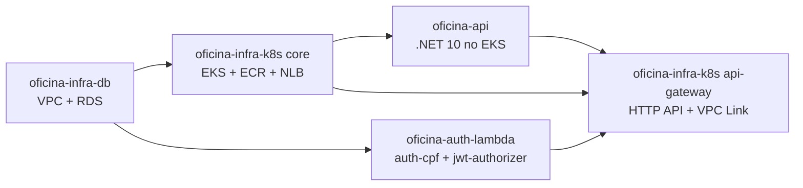
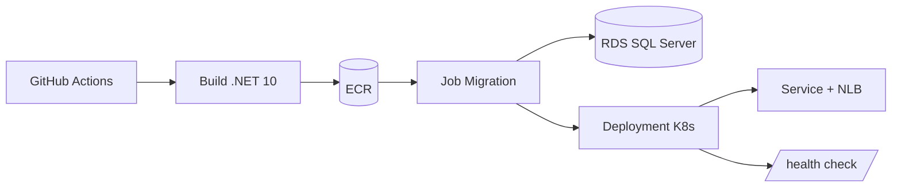

# oficina-api

## Visão geral

API REST principal da solução Oficina, implementada em .NET 10. Gerencia clientes, veículos, serviços, peças, estoque, ordens de serviço, diagnósticos, orçamentos e autorização JWT.

- Constrói a imagem Docker da API e publica no ECR (taggeada com `commit-sha` e `latest`).
- Aplica K8s Job de migrations no RDS antes do Deployment.
- Aplica Deployment + Service (NodePort no modo `terraform_nlb`, LoadBalancer interno no modo `aws_lbc`).
- Aplica HPA da aplicação com escala por CPU, usando Metrics Server instalado pelo [oficina-infra-k8s](https://github.com/fabianorodrigues/oficina-infra-k8s).
- No modo `aws_lbc`, grava o Listener ARN do NLB no SSM após o Service subir.

## Tecnologias utilizadas

- .NET 10 e ASP.NET Core
- Entity Framework Core
- SQL Server (RDS)
- Docker
- Kubernetes (AWS EKS)
- AWS ECR e SSM Parameter Store
- OpenTelemetry e Serilog
- Swagger/OpenAPI e Postman
- GitHub Actions

## Solução integrada

A solução Oficina é composta por 4 repositórios que formam um sistema de gestão de oficina mecânica na AWS.



| Passo | Repositório | Quando aplicar |
|---|---|---|
| 1 | [oficina-infra-db](https://github.com/fabianorodrigues/oficina-infra-db) | sempre |
| 2 | [oficina-infra-k8s](https://github.com/fabianorodrigues/oficina-infra-k8s) — core | sempre |
| 2a | [oficina-infra-k8s](https://github.com/fabianorodrigues/oficina-infra-k8s) — addons | sempre; AWS Load Balancer Controller apenas se `LOAD_BALANCER_PROVISIONING_MODE=aws_lbc` |
| 3 | [oficina-api](https://github.com/fabianorodrigues/oficina-api) | sempre |
| 4 | [oficina-auth-lambda](https://github.com/fabianorodrigues/oficina-auth-lambda) | sempre |
| 5 | [oficina-infra-k8s](https://github.com/fabianorodrigues/oficina-infra-k8s) — api-gateway | sempre |
| 6 | [oficina-api](https://github.com/fabianorodrigues/oficina-api) — redeploy | se o pod precisar refletir `public-base-url` em e-mails |
| 7 | [oficina-infra-k8s](https://github.com/fabianorodrigues/oficina-infra-k8s) — observability | opcional — somente após passo 5 |

Cada README detalha apenas a responsabilidade do seu repositório. Para o passo a passo dos demais, consulte os READMEs correspondentes.

## Arquitetura



## Configuração

Configure em `GitHub > Settings > Secrets and variables > Actions`.

> **JWT idêntico**: `JWT_SECRET`, `JWT_ISSUER`, `JWT_AUDIENCE` e `JWT_EXPIRATION_MINUTES` devem ser os mesmos valores configurados no [oficina-auth-lambda](https://github.com/fabianorodrigues/oficina-auth-lambda). Tokens emitidos pela Lambda só são validados pela API se as quatro variáveis baterem.

> **SMTP tudo ou nada**: se quaisquer das variáveis SMTP estiverem preenchidas, todas as quatro (`EMAIL_SMTP_HOST`, `EMAIL_SMTP_PORT`, `EMAIL_ENABLE_SSL`, `EMAIL_FROM`) devem estar presentes em conjunto com `EMAIL_SMTP_USERNAME` e `EMAIL_SMTP_PASSWORD`. Caso contrário, o workflow falha na validação.

### Obrigatório

| Nome | Tipo | Descrição |
| --- | --- | --- |
| `AWS_ACCESS_KEY_ID` | Secret | Credencial AWS |
| `AWS_SECRET_ACCESS_KEY` | Secret | Credencial AWS |
| `AWS_REGION` | Secret | Região AWS |
| `ECR_REPOSITORY_URL` | Secret | URL completa do repositório ECR (output do [oficina-infra-k8s](https://github.com/fabianorodrigues/oficina-infra-k8s) root core) |
| `EKS_CLUSTER_NAME` | Secret | Nome do cluster EKS (output do [oficina-infra-k8s](https://github.com/fabianorodrigues/oficina-infra-k8s) root core) |
| `DB_CONNECTION_STRING` | Secret | String de conexão com o SQL Server (composta a partir do [oficina-infra-db](https://github.com/fabianorodrigues/oficina-infra-db)) |
| `JWT_SECRET` | Secret | Chave de assinatura JWT (mínimo 32 caracteres) — idêntico ao [oficina-auth-lambda](https://github.com/fabianorodrigues/oficina-auth-lambda) |
| `JWT_ISSUER` | Secret | Issuer JWT — idêntico ao [oficina-auth-lambda](https://github.com/fabianorodrigues/oficina-auth-lambda) |
| `JWT_AUDIENCE` | Secret | Audience JWT — idêntico ao [oficina-auth-lambda](https://github.com/fabianorodrigues/oficina-auth-lambda) |
| `JWT_EXPIRATION_MINUTES` | Secret | Expiração dos tokens em minutos — idêntico ao [oficina-auth-lambda](https://github.com/fabianorodrigues/oficina-auth-lambda) |

### Opcional

| Nome | Tipo | Default | Descrição |
| --- | --- | --- | --- |
| `AWS_SESSION_TOKEN` | Secret | — | Credenciais temporárias (STS) |
| `EMAIL_SMTP_USERNAME` | Secret | — | Usuário SMTP (obrigatório se SMTP habilitado) |
| `EMAIL_SMTP_PASSWORD` | Secret | — | Senha SMTP (obrigatório se SMTP habilitado) |
| `ADMIN_INICIAL_NOME` | Secret | — | Nome do admin inicial (apenas se input `enable_initial_admin=true`) |
| `ADMIN_INICIAL_CPF` | Secret | — | CPF do admin inicial (apenas se input `enable_initial_admin=true`) |
| `ADMIN_INICIAL_SENHA` | Secret | — | Senha do admin inicial (apenas se input `enable_initial_admin=true`) |
| `PROJECT_NAME` | Variable | `oficina` | Prefixo lógico |
| `ENVIRONMENT` | Variable | `dev` | Ambiente |
| `LOAD_BALANCER_PROVISIONING_MODE` | Variable | `terraform_nlb` | `terraform_nlb` ou `aws_lbc` |
| `API_NODE_PORT` | Variable | `30080` | NodePort esperado (faixa 30000-32767) |
| `EMAIL_SMTP_HOST` | Variable | — | Servidor SMTP (obrigatório se SMTP habilitado) |
| `EMAIL_SMTP_PORT` | Variable | — | Porta SMTP (obrigatório se SMTP habilitado) |
| `EMAIL_ENABLE_SSL` | Variable | — | `true` ou `false` (obrigatório se SMTP habilitado) |
| `EMAIL_FROM` | Variable | — | Endereço de origem (obrigatório se SMTP habilitado) |
| `EMAIL_BASE_URL_APROVA_RECUSA_ORCAMENTO` | Variable | SSM `public-base-url` ou vazio | URL base para links em e-mails |

### Auto-provisionados pelo workflow

- Namespace `oficina` no EKS.
- ConfigMap `oficina-api-config` e Secret `oficina-api-secret`.
- SSM `/<projeto>/<ambiente>/api/backend-listener-arn` (apenas no modo `aws_lbc`).
- Imagem ECR taggeada com `commit-sha` e `latest`.

### Obtendo o ECR_REPOSITORY_URL

Após o deploy do [oficina-infra-k8s](https://github.com/fabianorodrigues/oficina-infra-k8s) root core:

```powershell
$env:AWS_REGION="<regiao>"
$env:ECR_REPOSITORY_NAME="oficina-api"

aws ecr describe-repositories --repository-names $env:ECR_REPOSITORY_NAME --region $env:AWS_REGION --query "repositories[0].repositoryUri" --output text
```

Configure o valor retornado como o Secret `ECR_REPOSITORY_URL`.

## Execução

Execute manualmente:

```text
GitHub Actions > Deploy API > Run workflow
```

O input `enable_initial_admin` deve ser `true` apenas na criação controlada do admin inicial em banco vazio. Nas execuções seguintes, mantenha `false`.

No modo `terraform_nlb`, o workflow aplica `service-nodeport.yaml`, valida que `API_NODE_PORT` bate com a porta do Target Group, aguarda o rollout do Deployment e valida `/health` via `kubectl port-forward`.

No modo `aws_lbc`, o workflow aplica `service.yaml`, valida o NLB interno criado pelo controller e grava o Listener ARN no SSM.

## Validação

### Console

- Em ECR, confirme imagem com tag do commit e tag `latest`.
- Em EKS, confirme Deployment, Pods, Service e HPA no namespace `oficina`.
- No modo `terraform_nlb`, confirme Service do tipo `NodePort`.
- No modo `aws_lbc`, confirme Load Balancer interno do tipo network.
- Em SSM Parameter Store, confirme `/${PROJECT_NAME}/${ENVIRONMENT}/api/backend-listener-arn`.

### CLI (PowerShell)

```powershell
$env:AWS_REGION="<regiao>"
$env:ENVIRONMENT="<ambiente>"
$env:PROJECT_NAME="oficina"
$env:EKS_CLUSTER_NAME="<nome-do-cluster>"
$env:ECR_REPOSITORY_NAME="<nome-do-repositorio-ecr>"

aws ecr describe-images --repository-name $env:ECR_REPOSITORY_NAME --image-ids imageTag="<commit-sha>" --region $env:AWS_REGION --query "length(imageDetails)"
aws eks update-kubeconfig --name $env:EKS_CLUSTER_NAME --region $env:AWS_REGION
kubectl rollout status deployment/oficina-api -n oficina
kubectl get svc oficina-api -n oficina -o jsonpath='{.spec.type}{" nodePort="}{.spec.ports[0].nodePort}{"\n"}'
kubectl get hpa oficina-api -n oficina
kubectl top pods -n oficina
aws ssm get-parameter --name "/$($env:PROJECT_NAME)/$($env:ENVIRONMENT)/api/backend-listener-arn" --region $env:AWS_REGION --query "Parameter.Name"
```

### Health check e Swagger via port-forward

O Swagger não é exposto pelo API Gateway — apenas `/health` e `/api/*` são roteados publicamente. Para acessar o Swagger ou testar endpoints diretamente no pod, use `kubectl port-forward`.

1. Abra o túnel (mantenha o terminal aberto):

   ```powershell
   kubectl port-forward svc/oficina-api -n oficina 18080:80
   ```

2. Em outro terminal, valide o health check:

   ```powershell
   Invoke-RestMethod http://127.0.0.1:18080/health
   ```

3. No browser, acesse o Swagger:

   ```text
   http://localhost:18080/swagger
   ```

### Testes via Postman Runner

Pré-requisito: passo 5 (API Gateway) concluído para usar a URL pública. Para ambiente local ou `port-forward`, qualquer etapa serve.

Arquivos: [pasta postman/](postman/)

- Collection: [postman/OficinaAPI-cenarios.postman_collection.json](postman/OficinaAPI-cenarios.postman_collection.json)
- Environment: [postman/OficinaAPI-cenarios.postman_environment.json](postman/OficinaAPI-cenarios.postman_environment.json)

Variáveis obrigatórias — configure apenas estas três antes de executar:

| Variável | Descrição |
| --- | --- |
| `baseUrl` | URL base da API (ver abaixo) |
| `adminCpf` | CPF do admin inicial (`ADMIN_INICIAL_CPF`) |
| `adminSenha` | Senha do admin inicial (`ADMIN_INICIAL_SENHA`) |

As demais variáveis são geradas e gerenciadas automaticamente pelos scripts da collection.

Como obter o `baseUrl`:

```powershell
# AWS — URL pública do API Gateway (passo 5 concluído)
aws ssm get-parameter --name "/$($env:PROJECT_NAME)/$($env:ENVIRONMENT)/api/public-base-url" --region $env:AWS_REGION --query "Parameter.Value" --output text

# AWS — via port-forward (kubectl port-forward ativo na porta 18080)
# baseUrl = http://127.0.0.1:18080

# Local — Docker Compose
# baseUrl = http://localhost:8080
```

Como executar via Runner:

1. Abra o Postman e importe a collection e o environment.
2. Selecione o environment importado e preencha as três variáveis obrigatórias.
3. Clique com o botão direito na collection > **Run collection**.
4. Confirme que todas as requisições estão selecionadas e clique em **Run**.

## Execução local

Pré-requisitos: .NET 10 SDK, Docker e Docker Compose.

```powershell
Copy-Item docker/.env.example docker/.env
docker compose --profile local-db --env-file docker/.env -f docker/docker-compose.yml up -d sqlserver smtp4dev
docker compose --profile local-db --env-file docker/.env -f docker/docker-compose.yml run --rm migration
docker compose --profile local-db --env-file docker/.env -f docker/docker-compose.yml up -d api
```

Edite `docker/.env` com valores próprios — nunca versione credenciais reais.

Build, testes e health check:

```powershell
dotnet restore Oficina.sln
dotnet build Oficina.sln --configuration Release --no-restore
dotnet test Oficina.sln --configuration Release --no-build

Invoke-RestMethod http://localhost:8080/health
Invoke-RestMethod http://localhost:8080/ready
```

Swagger local:

```text
http://localhost:8080/swagger
```

## Observabilidade

A API usa OpenTelemetry/OTLP como contrato de observabilidade independente de fornecedor. Ela emite logs JSON estruturados em stdout via Serilog, propaga `X-Correlation-Id` por requisição e exporta traces e métricas por OTLP quando `OTEL_EXPORTER_OTLP_ENDPOINT` está configurado corretamente.

### Configurar

| Nome | Tipo | Default | Descrição |
| --- | --- | --- | --- |
| `OTEL_EXPORTER_OTLP_ENDPOINT` | Variable | — | Endpoint OTLP do backend escolhido; vazio ou inválido mantém a API sem exportação externa |
| `OTEL_EXPORTER_OTLP_HEADERS` | Secret | — | Headers do exportador OTLP, por exemplo autenticação |

Os logs JSON estruturados pelo Serilog são sempre emitidos, independentemente da configuração OTLP. Se `OTEL_EXPORTER_OTLP_ENDPOINT` estiver inválido, o workflow registra aviso e desliga a exportação OTLP para não interferir no deploy.

Exemplo New Relic US:

```text
OTEL_EXPORTER_OTLP_ENDPOINT=https://otlp.nr-data.net
OTEL_EXPORTER_OTLP_HEADERS=api-key=<license-key>
```

Para outro backend, troque apenas `OTEL_EXPORTER_OTLP_ENDPOINT` e `OTEL_EXPORTER_OTLP_HEADERS`.

### Executar

Não há workflow separado. As variáveis OTLP entram no pod pelo próprio `deploy-api`. Sem `OTEL_EXPORTER_OTLP_ENDPOINT`, ou com configuração OTLP inválida, o pod sobe sem exportador externo e os logs continuam disponíveis via `kubectl logs`.

Para habilitar dashboards, alertas e Synthetic Monitor no New Relic, aplique o root `terraform/observability` do [oficina-infra-k8s](https://github.com/fabianorodrigues/oficina-infra-k8s) somente após o passo 5 (API Gateway) estar concluído e a URL pública da API responder em `/health`.

### Validar

Backend OTLP configurado:

- **APM e traces**: gere tráfego em `/health` e em rotas `/api/*`, filtre por `service.name = 'oficina-api'`.
- **Logs**: pesquise por `correlationId` e pelos eventos de domínio (`OrdemServicoCriada`, `OrdemServicoStatusAlterado`, `OrdemServicoFalha`, `EmailOrcamentoFalha`) no backend que coleta stdout/Kubernetes logs.
- **Correlation ID**: envie uma requisição com header `X-Correlation-Id` e confirme o mesmo valor na resposta e nos logs.

CLI (PowerShell) — logs do pod sem precisar de backend externo:

```powershell
$env:AWS_REGION="<regiao>"
$env:EKS_CLUSTER_NAME="<nome-do-cluster>"

aws eks update-kubeconfig --name $env:EKS_CLUSTER_NAME --region $env:AWS_REGION
kubectl logs deployment/oficina-api -n oficina --tail 100
kubectl logs deployment/oficina-api -n oficina | Select-String "correlationId"
```

## Próxima etapa

Publicar [oficina-auth-lambda](https://github.com/fabianorodrigues/oficina-auth-lambda). Em seguida, aplicar o root `terraform/api-gateway` do [oficina-infra-k8s](https://github.com/fabianorodrigues/oficina-infra-k8s). O passo 6 (redeploy desta API) só é necessário se a aplicação precisar refletir a `public-base-url` recém-criada em e-mails; o passo 7 (`terraform/observability`) só deve ser aplicado depois do API Gateway validado.
