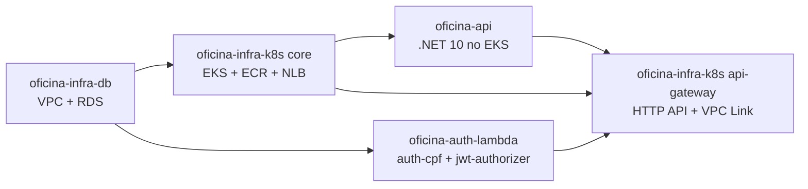
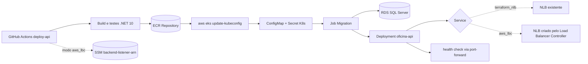

# oficina-api

## Visão geral

API REST principal da solução Oficina, implementada em .NET 10. Gerencia clientes, veículos, serviços, peças, estoque, ordens de serviço, diagnósticos, orçamentos e autorização JWT. É publicada no EKS e fica atrás do API Gateway provisionado pelo `oficina-infra-k8s`.

## Tecnologias utilizadas

- .NET 10 e ASP.NET Core
- Entity Framework Core
- SQL Server (RDS)
- Docker
- Kubernetes (AWS EKS)
- AWS ECR e SSM Parameter Store
- OpenTelemetry e Serilog
- Swagger/OpenAPI e Postman
- GitHub Actions

## Solução integrada

A solução Oficina é composta por 4 repositórios independentes que, juntos, formam um sistema de gestão de oficina mecânica na AWS.



| Passo | Repositório | Workflow | Quando aplicar |
|---|---|---|---|
| 1 | `oficina-infra-db` | Terraform Apply | sempre |
| 2 | `oficina-infra-k8s` root `terraform` (core) | Terraform Apply | sempre |
| 2a | `oficina-infra-k8s` root `terraform/addons` | Terraform Apply | apenas se `LOAD_BALANCER_PROVISIONING_MODE=aws_lbc` |
| 3 | `oficina-api` | Deploy API | sempre |
| 4 | `oficina-auth-lambda` | Deploy Lambda | sempre |
| 5 | `oficina-infra-k8s` root `terraform/api-gateway` | Terraform API Gateway Apply | sempre |
| 6 | `oficina-api` | Deploy API (redeploy) | se o pod precisar refletir `public-base-url` recém-criado em e-mails |

Cada README detalha apenas a responsabilidade do seu repositório. Para o passo a passo dos demais, consulte os READMEs correspondentes.

## Responsabilidade deste repositório

- Constrói a imagem Docker da API e publica no ECR (taggeada com `commit-sha` e `latest`).
- Aplica K8s Job de migrations no RDS antes do Deployment.
- Aplica Deployment + Service (NodePort no modo `terraform_nlb`, LoadBalancer interno no modo `aws_lbc`).
- No modo `aws_lbc`, grava o Listener ARN do NLB criado pelo Load Balancer Controller no SSM.

## Arquitetura



## Valores consumidos

| Origem | Valor | Como é consumido |
| --- | --- | --- |
| `oficina-infra-db` | endpoint, porta e nome do banco | compõem `DB_CONNECTION_STRING` configurado como Secret |
| `oficina-infra-k8s` (root core) | `ECR Repository URL`, `EKS Cluster Name` | Secret `ECR_REPOSITORY_URL` e Variable `EKS_CLUSTER_NAME` |
| `oficina-infra-k8s` (root api-gateway) | SSM `/<projeto>/<ambiente>/api/public-base-url` | lido pelo workflow para compor links em e-mails |
| `oficina-auth-lambda` | JWT `secret/issuer/audience/expiration` | devem ser **idênticos** aos configurados no `oficina-auth-lambda` |

## Valores gerados

- Imagem Docker no ECR, com tag `commit-sha` (imutável) e `latest`.
- Namespace `oficina` no EKS, ConfigMap `oficina-api-config` e Secret `oficina-api-secret`.
- Deployment `oficina-api` e Service correspondente ao modo selecionado.
- No modo `aws_lbc`, parâmetro SSM `/<projeto>/<ambiente>/api/backend-listener-arn` consumido pelo root `api-gateway` do `oficina-infra-k8s`.

## Configuração necessária

> **JWT idêntico**: `JWT_SECRET`, `JWT_ISSUER`, `JWT_AUDIENCE` e `JWT_EXPIRATION_MINUTES` devem ser os mesmos valores configurados no `oficina-auth-lambda`. Tokens emitidos pela Lambda só são validados pela API se as quatro variáveis baterem.

> **SMTP tudo ou nada**: se quaisquer das variáveis SMTP estiverem preenchidas, todas as quatro (`EMAIL_SMTP_HOST`, `EMAIL_SMTP_PORT`, `EMAIL_ENABLE_SSL`, `EMAIL_FROM`) devem estar presentes em conjunto com `EMAIL_SMTP_USERNAME` e `EMAIL_SMTP_PASSWORD`. Caso contrário, o workflow falha na validação.

### Secrets obrigatórios

| Nome | Origem ou Default | Descrição |
| --- | --- | --- |
| `AWS_ACCESS_KEY_ID` | — | Credencial AWS |
| `AWS_SECRET_ACCESS_KEY` | — | Credencial AWS |
| `AWS_REGION` | — | Região AWS |
| `ECR_REPOSITORY_URL` | Output de `oficina-infra-k8s` (root core) | URL completa do repositório ECR |
| `EKS_CLUSTER_NAME` | Output de `oficina-infra-k8s` (root core) | Nome do cluster EKS |
| `DB_CONNECTION_STRING` | Composto a partir de `oficina-infra-db` | String de conexão com o SQL Server |
| `JWT_SECRET` | Idêntico ao `oficina-auth-lambda` | Chave de assinatura JWT (mínimo 32 caracteres) |
| `JWT_ISSUER` | Idêntico ao `oficina-auth-lambda` | Issuer JWT |
| `JWT_AUDIENCE` | Idêntico ao `oficina-auth-lambda` | Audience JWT |
| `JWT_EXPIRATION_MINUTES` | Idêntico ao `oficina-auth-lambda` | Expiração dos tokens em minutos |

### Secrets opcionais

| Nome | Origem ou Default | Descrição |
| --- | --- | --- |
| `AWS_SESSION_TOKEN` | — | Credenciais temporárias (STS) |
| `EMAIL_SMTP_USERNAME` | — | Usuário SMTP (obrigatório se SMTP habilitado) |
| `EMAIL_SMTP_PASSWORD` | — | Senha SMTP (obrigatório se SMTP habilitado) |
| `ADMIN_INICIAL_NOME` | — | Nome do admin inicial (apenas se input `enable_initial_admin=true`) |
| `ADMIN_INICIAL_CPF` | — | CPF do admin inicial (apenas se input `enable_initial_admin=true`) |
| `ADMIN_INICIAL_SENHA` | — | Senha do admin inicial (apenas se input `enable_initial_admin=true`) |
| `NEW_RELIC_LICENSE_KEY` | — | License key para exportador OTLP |

### Variables

| Nome | Origem ou Default | Descrição |
| --- | --- | --- |
| `PROJECT_NAME` | `oficina` | Prefixo lógico |
| `ENVIRONMENT` | `dev` | Ambiente |
| `LOAD_BALANCER_PROVISIONING_MODE` | `terraform_nlb` | `terraform_nlb` ou `aws_lbc` |
| `API_NODE_PORT` | `30080` | NodePort esperado (faixa 30000-32767) |
| `EMAIL_SMTP_HOST` | — | Servidor SMTP (obrigatório se SMTP habilitado) |
| `EMAIL_SMTP_PORT` | — | Porta SMTP (obrigatório se SMTP habilitado) |
| `EMAIL_ENABLE_SSL` | — | `true` ou `false` (obrigatório se SMTP habilitado) |
| `EMAIL_FROM` | — | Endereço de origem (obrigatório se SMTP habilitado) |
| `EMAIL_BASE_URL_APROVA_RECUSA_ORCAMENTO` | SSM `public-base-url` ou vazio | URL base para links em e-mails |
| `NEW_RELIC_REGION` | `US` | `US` ou `EU` |
| `OTEL_EXPORTER_OTLP_ENDPOINT` | Escolhido pela região quando vazio | Override do endpoint OTLP |

### Auto-provisionados pelo workflow

- Namespace `oficina` no EKS.
- ConfigMap `oficina-api-config` e Secret `oficina-api-secret`.
- SSM `/<projeto>/<ambiente>/api/backend-listener-arn` (apenas no modo `aws_lbc`).
- Imagem ECR taggeada com `commit-sha` e `latest` (reusa a imagem existente quando o SHA já foi publicado).

### Obtendo o ECR_REPOSITORY_URL

Após o deploy do `oficina-infra-k8s` root core:

```powershell
$env:AWS_REGION="<regiao>"
$env:ECR_REPOSITORY_NAME="oficina-api"

aws ecr describe-repositories --repository-names $env:ECR_REPOSITORY_NAME --region $env:AWS_REGION --query "repositories[0].repositoryUri" --output text
```

Configure o valor retornado como o Secret `ECR_REPOSITORY_URL`.

## Como executar

Execute manualmente:

```text
GitHub Actions > Deploy API > Run workflow
```

O input `enable_initial_admin` deve ser `true` apenas na criação controlada do admin inicial em banco vazio. Nas execuções seguintes, mantenha `false`.

No modo `terraform_nlb`, o workflow:

- aplica `service-nodeport.yaml`;
- valida que `API_NODE_PORT` bate com a porta do Target Group criado pelo Terraform;
- valida o Service do tipo `NodePort`;
- aguarda o rollout do Deployment;
- valida `/health` via `kubectl port-forward`;
- valida que `/${PROJECT_NAME}/${ENVIRONMENT}/api/backend-listener-arn` existe no SSM.

No modo `aws_lbc`, o workflow aplica `service.yaml`, valida o NLB interno criado pelo controller e grava o Listener ARN no SSM.

## Como validar pela AWS

### Console

- Em ECR, confirme imagem com tag do commit e tag `latest`.
- Em EKS, confirme Deployment, Pods e Service no namespace `oficina`.
- No modo `terraform_nlb`, confirme Service do tipo `NodePort`.
- No modo `aws_lbc`, confirme Load Balancer interno do tipo network.
- Em SSM Parameter Store, confirme `/${PROJECT_NAME}/${ENVIRONMENT}/api/backend-listener-arn`.

### CLI (PowerShell)

```powershell
$env:AWS_REGION="<regiao>"
$env:ENVIRONMENT="<ambiente>"
$env:PROJECT_NAME="oficina"
$env:EKS_CLUSTER_NAME="<nome-do-cluster>"
$env:ECR_REPOSITORY_NAME="<nome-do-repositorio-ecr>"

aws ecr describe-images --repository-name $env:ECR_REPOSITORY_NAME --image-ids imageTag="<commit-sha>" --region $env:AWS_REGION --query "length(imageDetails)"
aws eks update-kubeconfig --name $env:EKS_CLUSTER_NAME --region $env:AWS_REGION
kubectl rollout status deployment/oficina-api -n oficina
kubectl get svc oficina-api -n oficina -o jsonpath='{.spec.type}{" nodePort="}{.spec.ports[0].nodePort}{"\n"}'
aws ssm get-parameter --name "/$($env:PROJECT_NAME)/$($env:ENVIRONMENT)/api/backend-listener-arn" --region $env:AWS_REGION --query "Parameter.Name"
```

### Health check e Swagger via port-forward

O Swagger não é exposto pelo API Gateway — apenas `/health` e `/api/*` são roteados publicamente. Para acessar o Swagger ou testar endpoints diretamente no pod, use `kubectl port-forward`.

1. Abra o túnel (mantenha o terminal aberto):

   ```powershell
   kubectl port-forward svc/oficina-api -n oficina 18080:80
   ```

2. Em outro terminal, valide o health check:

   ```powershell
   Invoke-RestMethod http://127.0.0.1:18080/health
   ```

3. No browser, acesse o Swagger:

   ```text
   http://localhost:18080/swagger
   ```

O túnel encerra quando o terminal for fechado. Enquanto aberto, a porta `18080` local aponta diretamente para o pod no EKS, sem passar pelo API Gateway.

### Testes via Postman Runner

Pré-requisito: passo 5 (API Gateway) concluído para usar a URL pública. Para ambiente local ou `port-forward`, qualquer etapa serve.

Arquivos: [pasta postman/](postman/)

- Collection: [postman/OficinaAPI-cenarios.postman_collection.json](postman/OficinaAPI-cenarios.postman_collection.json)
- Environment: [postman/OficinaAPI-cenarios.postman_environment.json](postman/OficinaAPI-cenarios.postman_environment.json)

Variáveis obrigatórias — configure apenas estas três antes de executar:

| Variável | Descrição |
| --- | --- |
| `baseUrl` | URL base da API (ver abaixo) |
| `adminCpf` | CPF do admin inicial (`ADMIN_INICIAL_CPF`) |
| `adminSenha` | Senha do admin inicial (`ADMIN_INICIAL_SENHA`) |

As demais variáveis (tokens, IDs, CPFs de teste) são geradas e gerenciadas automaticamente pelos scripts da collection durante a execução.

Como obter o `baseUrl` conforme o ambiente:

```powershell
# AWS — URL pública do API Gateway (passo 5 concluído)
aws ssm get-parameter --name "/$($env:PROJECT_NAME)/$($env:ENVIRONMENT)/api/public-base-url" --region $env:AWS_REGION --query "Parameter.Value" --output text

# AWS — via port-forward (kubectl port-forward ativo na porta 18080)
# baseUrl = http://127.0.0.1:18080

# Local — Docker Compose
# baseUrl = http://localhost:8080
```

Como executar via Runner:

1. Abra o Postman e importe a collection e o environment.
2. Selecione o environment importado e preencha as três variáveis obrigatórias.
3. Clique com o botão direito na collection > **Run collection**.
4. Confirme que todas as requisições estão selecionadas e clique em **Run**.

## Como executar localmente

Pré-requisitos: .NET 10 SDK, Docker e Docker Compose.

```powershell
Copy-Item docker/.env.example docker/.env
docker compose --profile local-db --env-file docker/.env -f docker/docker-compose.yml up -d sqlserver smtp4dev
docker compose --profile local-db --env-file docker/.env -f docker/docker-compose.yml run --rm migration
docker compose --profile local-db --env-file docker/.env -f docker/docker-compose.yml up -d api
```

Edite `docker/.env` com valores próprios — nunca versione credenciais reais.

## Como validar localmente

Build, testes e health check:

```powershell
dotnet restore Oficina.sln
dotnet build Oficina.sln --configuration Release --no-restore
dotnet test Oficina.sln --configuration Release --no-build

Invoke-RestMethod http://localhost:8080/health
Invoke-RestMethod http://localhost:8080/ready
```

Swagger local:

```text
http://localhost:8080/swagger
```

## Monitoramento e Observabilidade

A API emite logs JSON estruturados em stdout via Serilog, propaga `X-Correlation-Id` por requisição e exporta traces e métricas OpenTelemetry por OTLP quando configurada para New Relic. Os endpoints `/health` e `/ready` permanecem inalterados.

### Configurar

| Nome | Tipo | Obrigatório quando habilitado | Origem ou Default | Descrição |
| --- | --- | --- | --- | --- |
| `NEW_RELIC_LICENSE_KEY` | Secret | Sim | — | License key usada pelo exportador OTLP da API |
| `NEW_RELIC_REGION` | Variable | Não | `US` | `US` ou `EU` |
| `OTEL_EXPORTER_OTLP_ENDPOINT` | Variable | Não | Escolhido pela região | Override do endpoint OTLP |

Variáveis aplicadas no pod (auto-configuradas pelo workflow quando a license key existir):

- `OTEL_SERVICE_NAME=oficina-api`
- `OTEL_EXPORTER_OTLP_ENDPOINT`
- `OTEL_EXPORTER_OTLP_PROTOCOL=http/protobuf`
- `OTEL_EXPORTER_OTLP_HEADERS=api-key=<license-key>` via Secret K8s

Os logs JSON estruturados pelo Serilog são sempre emitidos, independentemente da configuração New Relic.

### Executar

Não há workflow separado. As variáveis OTLP entram no pod pelo próprio `deploy-api` quando a license key estiver configurada. Sem ela, o pod sobe sem exportador OTLP e os logs continuam disponíveis via `kubectl logs`.

Para habilitar dashboards, alertas e Synthetic Monitor, o root `terraform/observability` do `oficina-infra-k8s` deve ter sido aplicado.

### Validar

Console New Relic:

- **APM e traces**: gere tráfego em `/health` e em rotas `/api/*`, filtre por `service.name = 'oficina-api'`.
- **Logs**: pesquise por `correlationId` e pelos eventos de domínio (`OrdemServicoCriada`, `OrdemServicoStatusAlterado`, `OrdemServicoFalha`, `EmailOrcamentoFalha`).
- **Correlation ID**: envie uma requisição com header `X-Correlation-Id` e confirme o mesmo valor na resposta e nos logs.
- **Tempo por status**: o campo `statusDurationMs` aparece somente quando a duração é calculável a partir da transição observada.
- **EF Core**: a instrumentação de banco usa pacote beta do OpenTelemetry; em caso de instabilidade de restore/build, mantenha apenas HTTP, HttpClient, OTLP básico e logs estruturados.

CLI (PowerShell) — logs do pod sem precisar do New Relic:

```powershell
$env:AWS_REGION="<regiao>"
$env:EKS_CLUSTER_NAME="<nome-do-cluster>"

aws eks update-kubeconfig --name $env:EKS_CLUSTER_NAME --region $env:AWS_REGION
kubectl logs deployment/oficina-api -n oficina --tail 100
kubectl logs deployment/oficina-api -n oficina | Select-String "correlationId"
```

## Próxima etapa

Publicar `oficina-auth-lambda`. Em seguida, aplicar o root `terraform/api-gateway` do `oficina-infra-k8s`. O passo 6 (redeploy desta API) só é necessário se a aplicação precisar refletir a `public-base-url` recém-criada em e-mails.
